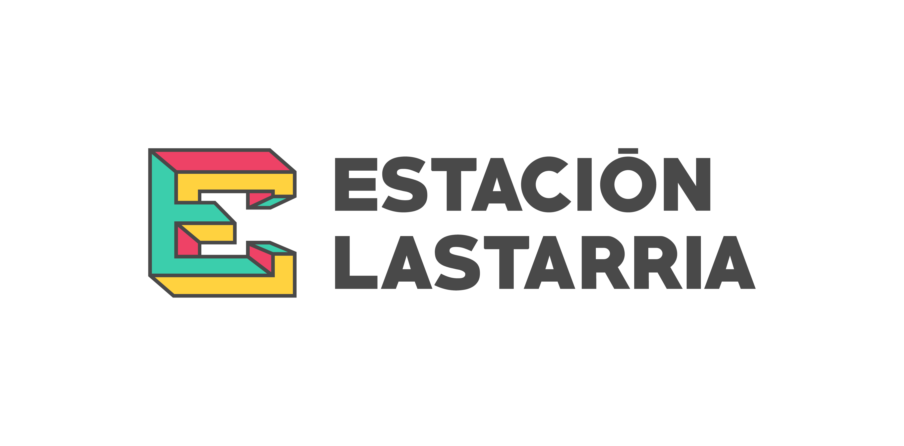
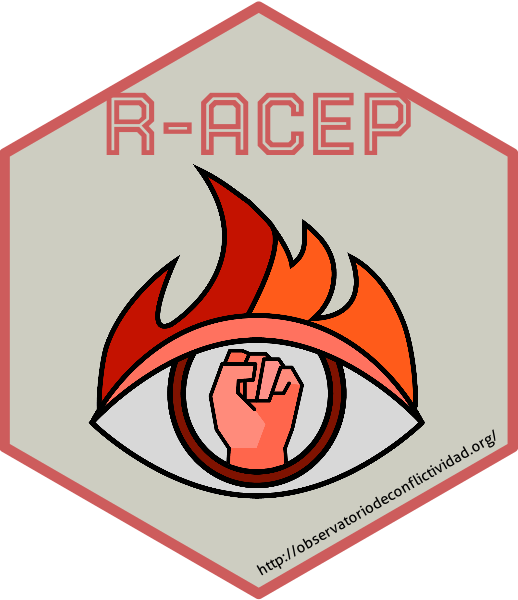

---
output:
  revealjs::revealjs_presentation:
    theme: moon
    highlight: zenburn
    center: true
    transition: convex
---

# Presentación del paquete ACEP{data-background-image="images/matrix02.png" style="position: absolute; width: 100%; right: 0; box-shadow: 1px 2px 4px rgba(0,0,0,2), 0 5px 25px rgba(255,0,0,2); background-color: rgba(0, 0, 0, 0.7); color: #FFA07A; text-align: center;"}

Herramientas computacionales para el análisis de la conflictividad social

<b>ACEP</b>: un paquete de funciones (en desarrollo) para el análisis computacional de la conflictividad social

Dr. Agustín Nieto (INHUS-CONICET/UNMdP)

agustin.nieto77@gmail.com | @agusnieto77

18 de agosto de 2022

{width=20%}
{width=8.5%}

# Objetivo

El objetivo de esta presentación es introducirnos en el análisis computacional (con R Project) de la conflictividad social visibilizada en la prensa digital; y mostrar los avances en el desarrollo de un paquete de funciones disponible en CRAN (ACEP).

## De palabras a números y viceversa

Alcance y límites de la minería de textos para la medición de la conflictividad social: experiencias de investigación en el marco del Observatorio de Conflictividad Social de la Universidad Nacional de Mar del Plata, Argentina.

**...**

**¿Cómo llegamos al enfoque computacional?**

# Presentación y contexto del enfoque computacional para el análisis de la conflictividad social

## El giro digital y la lectura distante

El giro digital y su boom de datos forzó diálogos insospechados entre las ciencias comunicacionales y las ciencias sociales y humanas. Las nuevas tecnologías y la proliferación de datos masivos en formato digital trajeron más desorden a los ya desordenados escritorios de científicxs sociales y humanistas (historiadorxs, sociólogxs, politólogxs, antropólogxs, filósofxs, etc., etc., etc.), que el contexto pandémico no hizo más que amplificar con su hipertrofiada virtualidad. 

* ¿Cómo hacer archivo de forma remota? 
* ¿Se puede hacer etnografía en la virtualidad? 
* ¿Las encuestas online son confiables? 
* ¿Son viables las entrevistas por telegram o whatsapp? 
* ¿Cómo ir a la hemeroteca sin salir de casa? 
* ¿Cómo leer cientos de periódicos sin hojearlos?
* ¿El enfoque computacional solo es útil para grandes masas de datos?

## Datos: ¿analógicos o digitales?

{width=90%}

## ¿Big Data vs. Small Data?

La distinción entre datos pequeños y grandes es reciente. Antes de 2008, los datos rara vez se consideraban en términos de "pequeños" o "grandes". Todos los datos eran, en efecto, lo que ahora a veces se denomina "Small Data", independientemente de su volumen (Kitchin & Lauriault, 2015).

{width=100%}

# Programación y ciencias sociales

Las relaciones entre programación y ciencias sociales no son nuevas, pero sí más visibles y necesarias que hace unos años. No parece ser conveniente encerrarse en una postura contraria. Estamos cada vez más cerca de la incorporación de técnicas y métodos computacionales en los planes de estudios de las carreras universitarias de grado. Ciencias Sociales Computacionales, Humanidades Digitales, Historia Digital, lectura distante, métodos cualitativos digitales, son nombres cada vez más escuchados en nuestros ámbitos de trabajo. Y lo serán aún más en poco tiempo. Aunque aún sean campos emergentes e inestables, tanto las ciencias sociales computacionales como las humanidades digitales llegaron para quedarse.

## Ciencias Sociales Computacionales y programación

Dentro de la maraña de epistemologías, problemáticas, metodologías, técnicas, enfoques y lenguajes de programación disponibles para adentrarse en el mundo de las ciencias sociales computacionales y las humanidades digitales, elegimos el camino autodidacta. A partir de un set pequeño de problemas concretos a resolver (cómo bajar de internet grandes cantidades de texto, de qué modo darle formato tabular, cómo limpiarlos, procesarlos, explorarlos y visualizarlos sin hacer una lectura cercana de lo recolectado) nos relacionaremos con lenguajes de programación como R, Python, PHP, SQL, etc., etc., para desarrollar ejercicios de web scraping, minería de texto y lectura distante.

## CATA: Campo del Análisis de Texto Asistido por Computadora

Este campo de análisis incluye métodos y técnicas computacionales relacionados con el análisis de contenido (semi) automatizado y la minería de textos.
En orden de antigüedad,las tres áreas centrales del CATA son: 1) técnicas que se basan en diccionarios y conteo simple de palabras, 2) aprendizaje automático supervisado, 3) aprendizaje automático no supervisado, y aprendizaje automático semi supervisado.
Si bien el CATA tiene un alcance mucho mayor, sus enfoques pueden usarse para dibujar una imagen precisa de los actores, los problemas y la dinámica temporal de los procesos conflictivos (Maerz & Puschmann, 2020).

## Enfoques computacionales

Estas técnicas pueden entenderse como existentes en un continuo, desde enfoques que son de naturaleza más deductiva y presuponen un conocimiento de dominio muy detallado y problemas de investigación precisos, como el análisis de diccionario; hasta métodos más inductivos como el aprendizaje no supervisado, más adecuados para la exploración.

{width=100%}

# Análisis computacional de la protesta

## ¿Desde cuándo?

Desde hace unos pocos años, las humanidades digitales y las ciencias sociales computacionales se propusieron avanzar en la investigación social utilizando el creciente poder de procesamiento informático de las computadoras de escritorio, las innovaciones metodológicas y el incesante crecimiento de la masa de datos para lograr un mejor conocimiento sobre los fenómenos sociales.

## ¿Por qué?

El conflicto es un fenómeno social fundamental y, por ende, debería ser un tema central en la agenda de investigación de las ciencias sociales y humanas. El giro digital torna a los enfoques computacionales en un elemento central en el campo de estudios de la conflictología. La confluencia de la creciente masa de datos masivos con las cada vez más evolucionadas técnicas procesamiento informático de corpus textuales permiten el modelado de dinámicas de conflicto. En este sentido, el objetivo de esta presentación es introducirnos brevemente al uso de algunos de estos enfoques computacionales como vía para mejorar nuestra comprensión de los procesos conflictivos.

## ¿Para qué?

El enfoque computacional en las investigaciones sobre procesos conflictivos, puede hacer avanzar al campo de estudios por tres ejes de relevancia: 1) la identificación de los conflictos como procesos espacio-temporales que permite rastrear la interacción de los actores en escenarios de conflicto y sus consecuencias, 2) la disponibilidad de nuevos conjuntos de datos detallados de eventos de conflicto en todas las escalas (local - global) gracias a la digitalización y a las técnicas computacionales para recolectar, almacenar y analizar estos datos, 3) la articulación de distintos enfoques y técnicas computacionales para el análisis de los nuevos datos disponibles.

## ¿Cómo?

Para el análisis de eventos de protesta podemos hacer uso de tres grandes enfoques en lo relativo a las técnicas de clasificación de los textos y su contenido:

* Diccionarios 

* Clasificación Supervisada

* Clasificación No/Semi Supervisada

# Hacia un laboratorio de análisis computacional de la conflictividad social

-   [Activismo barrial en perspectiva histórica: un acercamiento
    computacional](https://gesmar.estudiosmaritimossociales.org/Informe_GESMar_PI3CET_parte1.html)
    
-   [SISMOS - Conflictividad social en Mar del Plata – Informe
    anual](https://observatoriodeconflictividad.org/conflictividad-social-en-mar-del-plata-informe-anual/)
    
-   [El Pulso de la conflictividad en tiempo real](https://observatoriodeconflictividad.org/el-pulso-de-la-conflictividad-en-tiempo-real/)

-   [Paquete ACEP](https://agusnieto77.github.io/ACEP/)

# Presentación del paquete ACEP{data-background-image="images/matrix02.png" style="position: absolute; width: 100%; right: 0; box-shadow: 1px 2px 4px rgba(0,0,0,2), 0 5px 25px rgba(255,0,0,2); background-color: rgba(0, 0, 0, 0.7); color: #FFA07A; text-align: center;"}

**¡Gracias!**

Dr. Agustín Nieto (INHUS-CONICET/UNMdP)

agustin.nieto77@gmail.com | @agusnieto77

18 de agosto de 2022

{width=20%}
{width=8.5%}